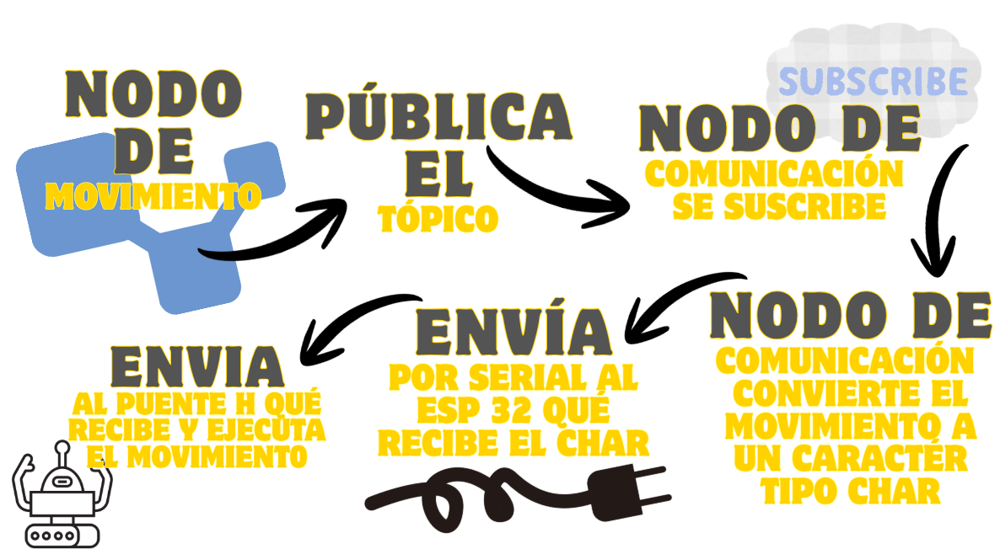

**Carrito RASTER MCQUEEN - Junior 1**

**Universidad Javeriana - RAS JAVERIANA**

Integrantes:

**1** Juan Felipe Quintero Vargas
**2** Samuel ANdres Diaz Villalba

## DESCRIPCIÓN

**Descripción General** 


El carrito Raster Mcqueen es un carrito róbotico basado en protocolos de Comunicacion detipo Serial Bajo ROS2, el carrito se mueve en todas las direcciones base (Adelante, Atrás, Izquierda y Derecha) y tiene un sensor ultrasónico que hace que el mismo se detenga bajo la detección de un objeto. 

En este README encontrarás cómo conectar, compilar y poner en funcionamiento a Carrito Raster Mcqueen. - Este auto Robótico fue desarrollado para **RAS IEEE Javeriana - Junior 1.**

## CÓMO ENTENDER EL PROYECTO EN PALABRAS SIMPLES 

Para Entender el Proyecto y porqué su importancia y relevancia de desarrollarlo bajo el marco de las bases de ROS2

**Se tiene**

A RASTER MCQUEEN - QUE TIENE DOS TAREAS PRINCIPALES: Se mueve en las 4 Direcciones Base y Se detiene ante la presencia de un Obstaculo

**¿Qué hace el proyecto?**

**Se usa ROS2 - Cómo el Eje Comunicador donde ROS actúa cómo el "cerebro"del robot, permitiendo que el hardware y el software se comuniquen de manera eficiente.**

**Para Esto Se crean 2 NODOS** - **Cada Nodo contiene una tarea a realizar**

En nuestro caso tenemos:
1. El nodo de Movimiento
2. El nodo de COmunicación

El flujo final del proyecto se Observa en el siguiente diagrama. 




## HARDWARE

**Composición del HARDWARE**
- Un microcontrolador con Tarjeta Expansora ESP32
- Un Puente H - L298N
- Un conversor de Voltaje - LM2596
- Un sensor tipo HC-SR04
- 2 Motores
- 3 Baterías de 3.7V
- Cables Tipo Jumper Hembra-Hembra
- Cables Tipo Jumper Macho-Hembra
- 1 Rueda Loca
- Cable Micro USB 

**Disposcición de los Pines del ESP32 - Puente H**
| Puente H | ESP32  | 
|----------|--------| 
|IN1       | GPIO33 |
|IN2       | GPIO32 |
|IN3       | GPIO26 |
|IN4       | GPIO27 |

**Disposcición de los Pines del ESP32 - Sensor HC-SR04**
| Sensor | ESP32   | 
|--------|---------|
| TRIG   | GPIO025 |
| ECHO   | GPIO019 |
| GNG    | GND     |
| VCC    | VCC     |

## SETUP
**1 PREREQUISITOS**

Para poder Ejecutar el Carrito se debe tener instalado

- Linux en el sistema Operativo del Computador
- ROS 2 - En este caso la versión: **Humble**
- Visual Studio Code Python, C++ y sus **Extensiones** ademas de **PlatformIO**
- Librería pyserial: `sudo apt-get install python3-serial`

**2 CLONAR EL REPOSITORIO DE GITHUB**

```bash
git clone https://github.com/Juanfe234q/RAS-Junior1-Carrito-JuanfeQV
cd RAS-Junior1-Carrito-JuanfeQV
```

**3 CARGAR EL FIRMWARE AL ESP32**

Una vez teniendo el repositorio cargado:

1. Abrir **PlatformIO** en VS Code
2. Seleccionar **Open Project**
3. Navegar a **src/platformio_carrito** y abrirlo

**Importante:** Conectar el cable MicroUSB al ESP32 antes de continuar

4. Dentro de platformIO seguir el siguiente flujo:
   - ESP32 Dev → General --> Build
   - ESP32 Dev → General --> Upload

Una vez ambas opciones digan **SUCCESS** el firmware está cargado en el ESP32.

En caso de que se desee comprobar en tiempo real la conexión en cable serial: 
1. Abrir el Monitor Serial
2. En caso de que este presente Bucle o Ruido Presionar el Reinicio del Microcontrolador
3. Una Vez emita el mensaje donde la conexión este lista se habrá comprobado la comunicación serial 

**Para pruebas de RASTER MCQUEEN cerrar el monitor Serial**

## COMPILAR Y CORRER LOS NODOS DE ROS 2

Abrir una terminal y compilar el workspace:

```bash
cd ~/Documents/Junior1
colcon build --symlink-install
source ~/.bashrc
```

Luego abrir **dos terminales** y correr:

**Terminal 1 - Nodo de Comunicación Serial:**
```bash
ros2 run carrito_samu_juanfe comando_comunicacion
```

**Terminal 2 - Nodo de Movimiento:**
```bash
ros2 run carrito_samu_juanfe comando_movimiento
```

**Los Controles Son:**
| Tecla         | Acción    |
|---------------|-----------|
| Flecha Arriba | Adelante  |
| Flecha Abajo  | Atrás     |
| I             | Izquierda |
| D             | Derecha   |
| Ctrl+C        | Salir     |

Entre las Dos Terminales debe de Verse la Correlación de conunicación entre **COMANDO ENVIADO** y **COMANDO RECIBIDO**

## DEMO VIDEO

[Watch here](https://www.youtube.com/shorts/QARdYJ6Z8mI)


